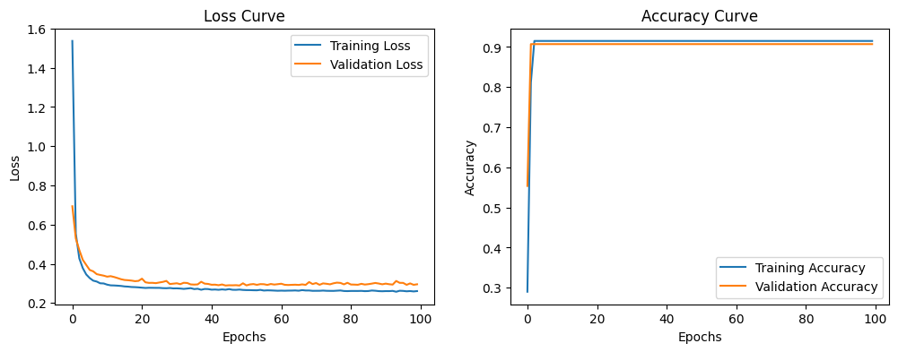

== 3.1 Model Construction
Attempt to Build a Neural Network Model 

A neural network model is constructed to fit the characteristics of countries that have won their first medal in past years.

Let $X=[x_1,x_2,x_3]$ Here ，
| Symbols | meaning                          |
|---------|----------------------------------|
| $x_1$   | The number of editions in which the country has participated without winning any medals since its first participation. |
| $x_2$   | The number of athletes the country has in this edition        |
| $x_3$   | The average number of medals awarded in this edition.               |

Use $X$ as the input layer, establish two hidden layers with 4 and 3 neurons respectively, and set the output layer with 1 neuron to represent the probability of winning a medal.

$y$ represents whether a medal is won in the next edition, where $y=0$ indicates no medal,and $y=1$ indicates a medal is won.

== 3.2 Model Solution

=== 3.2.1 Data Preparation

The dataset is processed based on the files provided on the official website. The samples are split into training and testing sets with a ratio of 0.2.

The flowchart of sample data preparation is represented as follows.

=== 3.2.2 Neural Network Framework Construction

$a^{(i)}$ represents the activation value of the i-th layer.

$a^{(2)}=g(\Theta^{(1)}X)$

$a^{(3)}=g(\Theta^{(2)}a^{(2)})$

$a^{(4)}=g(\Theta^{(3)}a^{(3)})$

$\hat y=a^{(4)}$

Here, $\Theta^{(i)}$ represents the propagation matrix, and $g$ denotes the activation function. In this case, the sigmoid function is used as the activation function, with an output range of $(0,1)$

=== 3.2.2 Cost Function

The binary cross-entropy loss function measures the difference between the predicted value $\hat y$ and the actual value $y$ .

$$
J(\Theta)=-\frac{1}{n}\sum^n_{i=1}[y^{(i)}log(\hat y^{(i)})+(1-\hat y^{i})]
$$

=== 3.2.3 Problem Transformation

The model's learning involves minimizing the loss function by optimizing parameters through sample-based learning.

=== 3.2.4 Parameter Optimization

==== 3.2.4.1 Optimization Methods

Use the gradient descent method to optimize the loss function. By iterating over each sample, calculate the gradients using backpropagation to obtain $\frac{\partial J}{\partial \Theta^{(i)}_{jk}}$
Let $\eta$ learning rate.

The parameter update rule is given by:

$$
\Theta^{(i)} _ {jk} := \Theta^{(i)} _ {jk} - \eta \frac{\partial J}{\partial \Theta^{(i)}_{jk}}
$$

This process is repeated iteratively until convergence or the maximum number of iterations is reached.

Since gradient descent requires repeated calculations over a large number of samples to compute the average, to improve algorithm performance, we adopt a grouped averaging approach for descent.Let$m$represent the number of groups into which the samples will be divided. In each iteration, every group is processed, and the descent is performed using the average gradient of each group.

==== 3.2.4.2 Model Training

The main steps are shown in the following:

**step1**:Initialize the parameters $\Theta^{(1)}, \Theta^{(2)}, \Theta^{(3)}$ the maximum number of iterations (epochs), and the number $m$ of groups. 

**step2**:Forward propagation to compute $a^{(2)},a^{(3)},a^{(4)}$

**step3**:Group the samples based on  $m$ , which represents the number of groups

**step4**: For each sample group, calculate the gradient of each parameter using the backpropagation method.

**step5**: Perform gradient descent for each parameter after obtaining the average gradient of each sample group, and repeat until all groups have completed their iterations.

**step6**: Record the loss function value after each iteration.

**step7**: Determine whether the maximum number of iterations has been reached. If satisfied, stop the training; otherwise, repeat steps 2 to 7.

== 3.3 Model evaluation

Through the trained model, the learning curve and accuracy curve are observed, and the fitting performance is as follows:

It can be observed that the classifier trained by this model demonstrates high accuracy and a low loss value.

The final model predicts the probability of countries that have not previously won a medal winning a medal in the next event. The results are shown in the figure below. ***Since many countries have a probability close to zero, only the top 10 countries most likely to win their first medal are displayed.***

