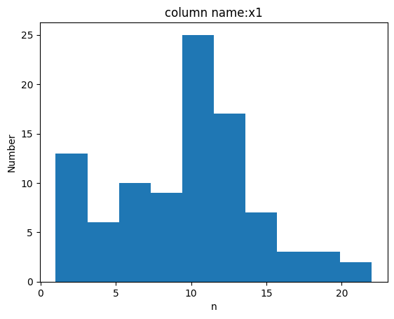
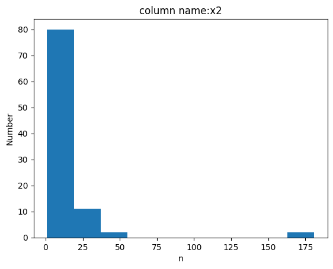
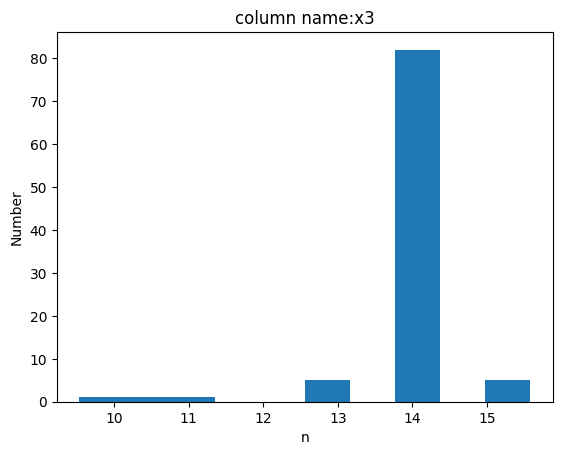

When conducting the fitting probability analysis, we plotted the distribution of non-award-winning countries across various variables.

Figure 1 - Distribution of Feature x1:

The distribution of feature x1 reveals that most countries have not won any awards across 8 to 10 consecutive Olympic Games since their participation began. This phenomenon may be attributed to the geopolitical shifts approximately 40 years ago during the Cold War between the United States and the Soviet Union, when the balance of power began tilting towards Western capitalism. Political transitions in Eastern European socialist countries (e.g., East Germany, Poland, Hungary) led to reforms and opening up of their economies. Improved relations with the West motivated many of these nations to engage more actively in international affairs, including the Olympic Games.

Figure 2 - Distribution of Feature x2:

Analysis of feature x2 shows that countries which have never won any awards typically send a relatively small number of athletes to the Games, with most sending fewer than nine participants. A limited number of athletes is evidently one of the key characteristics of countries that have never achieved award recognition.

Figure 3 - Distribution of Feature x3:

Most countries last participated in the Olympics in 2024, as shown by the distribution of feature x3. A minority of countries ceased participation before 2024, and their last appearance in the Games also resulted in no awards.