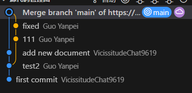

## 尝试连接此库

### Shunxing Xie  testings done

## 连上了喵

<!-- @GYPpro gypplus@outlook.com -->

什么叫`Unable to read file: ENOENT: no such file or directory, open 'd:\Desktop\Document\Coding\FULL STACK\MCM_Document\.git\refs\remotes\origin\main'`

重新提交一次没事了，应该是偶发问题。

所以我的branch是main你的也是main但是没法同步得我来同步吗？为什么会有两条线路

